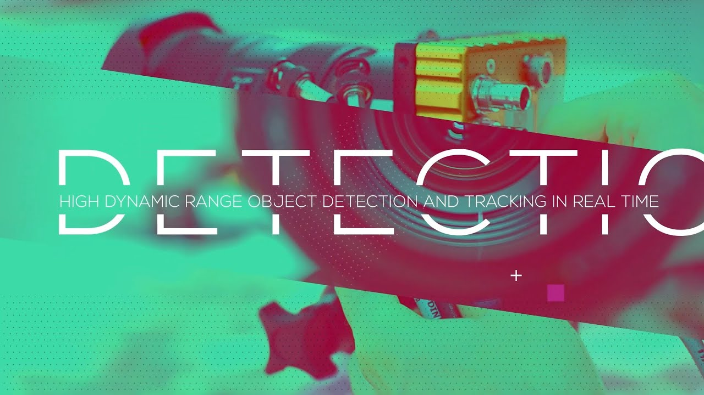

# 🚗 Real-Time Vehicle Detection & Classification System



## 📌 Overview

The **Real-Time Vehicle Detection & Classification System** is a Computer Vision and Deep Learning project developed using **YOLOv3**, **OpenCV**, and **Python** to detect, classify, track, and count vehicles from real-time video streams.

The system performs high-speed object detection with improved accuracy and supports multiple vehicle classes including:

- 🚘 Cars
- 🚌 Buses
- 🚚 Trucks
- 🏍️ Motorbikes
- 🚲 Bicycles
- 🚆 Trains

This project combines **Deep Learning**, **Image Processing**, and **Video Analytics** techniques to provide efficient real-time vehicle monitoring.

---

# ✨ Features

✅ Real-Time Vehicle Detection  
✅ Vehicle Classification using YOLOv3  
✅ Vehicle Counting System  
✅ Object Tracking using Centroid Tracking  
✅ GUI-based Video Upload System  
✅ Background Subtraction & Noise Reduction  
✅ FPS Monitoring  
✅ GPU Support using CUDA  
✅ Output Video Generation  
✅ Multiple Vehicle Detection Support  

---

# 🛠️ Tech Stack

## Programming Language
- Python

## Libraries & Frameworks
- OpenCV
- NumPy
- SciPy
- Imutils
- Tkinter

## Deep Learning
- YOLOv3
- COCO Dataset

## Concepts Used
- Computer Vision
- Object Detection
- Deep Learning
- Image Processing
- Video Analytics

---

# 📂 Project Structure

```bash
Vehicle-Detection-Classification-System/
│
├── Main1.py
├── main.py
├── Gui.py
├── yolo_video.py
├── input_retrieval.py
├── runDetections.py
├── requements.txt
│
├── inputVideos/
├── outputVideos/
├── yolo-/
│   ├── yolov3.weights
│   ├── yolov3.cfg
│   └── coco.names
│
├── a.png
├── 1.jpg
└── README.md
```

---

# ⚙️ Installation

## 1️⃣ Clone the Repository

```bash
git clone https://github.com/YOUR_USERNAME/vehicle-detection-classification-system.git
cd vehicle-detection-classification-system
```

---

## 2️⃣ Install Dependencies

```bash
pip install -r requements.txt
```

Or manually install the required libraries:

```bash
pip install opencv-python==4.3.0.38
pip install imutils==0.5.4
pip install scipy==1.4.1
pip install numpy
```

---

# 📥 Download YOLO Files

Create a folder named:

```bash
yolo-
```

Download these files into the folder:

- `yolov3.weights`
- `yolov3.cfg`
- `coco.names`

### YOLO Weights Download Link
https://pjreddie.com/media/files/yolov3.weights

---

# ▶️ Run the Project

## Run GUI Application

```bash
python Gui.py
```

---

## Run Detection Using Command Line

```bash
python Main1.py --input inputVideos/bridge.mp4 --output outputVideos/output.avi --yolo yolo-
```

---

## Run with GPU Support

```bash
python Main1.py --input inputVideos/bridge.mp4 --output outputVideos/output.avi --yolo yolo- --use-gpu 1
```

---

# 🧠 How It Works

1. Upload/Input video stream  
2. Convert video into frames  
3. Apply image preprocessing  
4. Perform object detection using YOLOv3  
5. Track detected vehicles  
6. Count vehicles crossing the detection line  
7. Generate output video with detection boxes  

---

# 📸 Screenshots

## Detection System


---

# 📊 Results

- ✅ Achieved high real-time detection accuracy
- ✅ Reduced false positives using optimized detection techniques
- ✅ Improved vehicle tracking performance
- ✅ Supports multiple vehicle classifications
- ✅ Real-time video processing capability

---

# 🔥 Future Enhancements

- Traffic Density Analysis
- Automatic Number Plate Recognition (ANPR)
- Speed Detection System
- Smart Traffic Signal Integration
- Cloud Deployment
- Live CCTV Integration

---

# 👨‍💻 Author

## Teja Chinthakindi

📧 Email: tejachinthakindi005@gmail.com  
💼 LinkedIn: [https://www.linkedin.com/in/chinthakindi-teja](https://www.linkedin.com/in/chinthakindi-teja-14a64b300/)  
🐙 GitHub: https://github.com/TEJA-1PER

---

# ⭐ Support

If you like this project:

⭐ Star this repository  
🍴 Fork this repository  
📢 Share with others  
